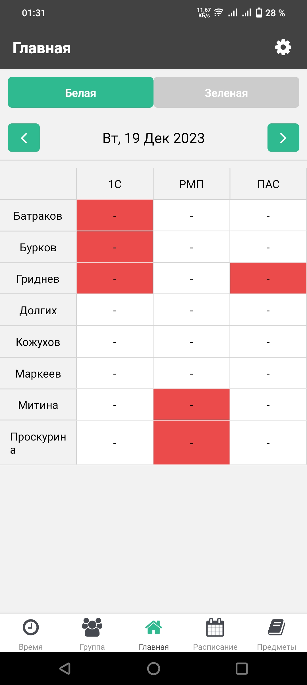

# Приложение "Журнал старосты"

## Описание
Приложение создано в рамках курсовой работы, 4 курс. Технологии: React Native, Expo, SQLite.
«Журнал старосты» — это кроссплатформенное приложение, созданное для эффективного учета посещаемости студентов на занятиях. Предусмотрено 5 вкладок в основном меню. Имеются настройки с возможностью переключения текущего семестра.

## Функционал
1. Ведение учета посещений в виде удобной таблицы.
2. Хранение, добавление и удаление списков студентов, предметов, времени
3. Хранение расписания в режиме "белая/зеленая" неделя, разбиение расписания по дням недели.
4. Хранение историй посещений по семестрам.

## Скриншоты


## Развертывание
Для развертывания приложения выполните следующие шаги:

1. Убедитесь, что у вас установлен Node.js и npm.
   - [Node.js](https://nodejs.org/)
   - [npm](https://www.npmjs.com/get-npm)
2. Установите Expo CLI с помощью команды:
   `npm install -g expo-cli`
3. В терминале перейдите в каталог вашего проекта и установите зависимости
    ```
    cd путь_к_вашему_проекту
    npm install
    ```
4. Запустите приложение с помощью Expo CLI
    `npx expo start`
5. Отсканируйте QR-код, который появится в консоли Expo, с помощью приложения Expo на своем мобильном устройстве.
6. Для сборки приложения для публикации выполните
    ```
    npx expo build:android
    # или
    npx expo build:ios
    ```

## Важно
Функционал реализован в базовом варианте и нуждается в доработках. В текущем варианте не удалены выводы в консоль.
